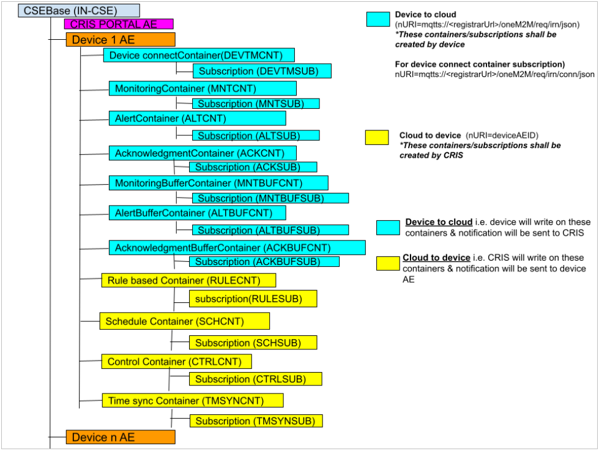
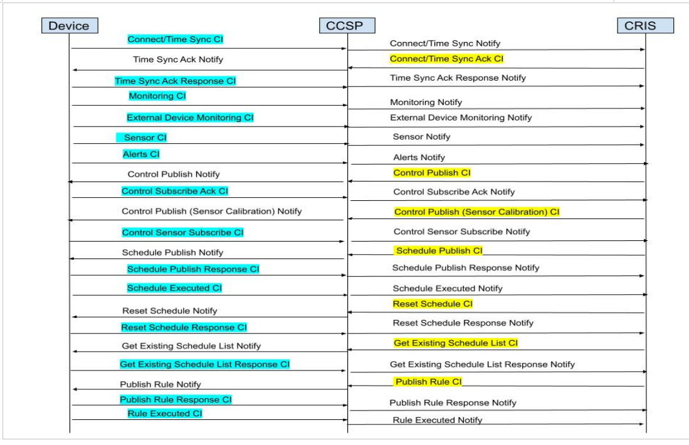

# Welcome to IRNIYANTRAC Guide

This section provides useful details about IRNIYANTRAC project and its messages.

## About IRNIYANTRAC
```
IRNIYANTRAC stands for "Indian Railways Native IoT based Yield Analysis Telemetry, Recording and Control". 
IR-NIYANTRAC is an application platform deployed by CRIS for monitoring and control of electrical assets and energy. 
The project not just helps in automation of electrical assets of railways but also in predictive and preventive maintainance of railways electrical assets. 

```
<p>For more details, please visit the <a href="https://niyantrac.railsaver.gov.in/IRNIYANTRAC/" target="_blank">IR-NIYANTRAC website</a>.</p>

## IRNIYANTRAC Resource Hierarchy



## IR-NIYANTRAC Message Communication Flow 

