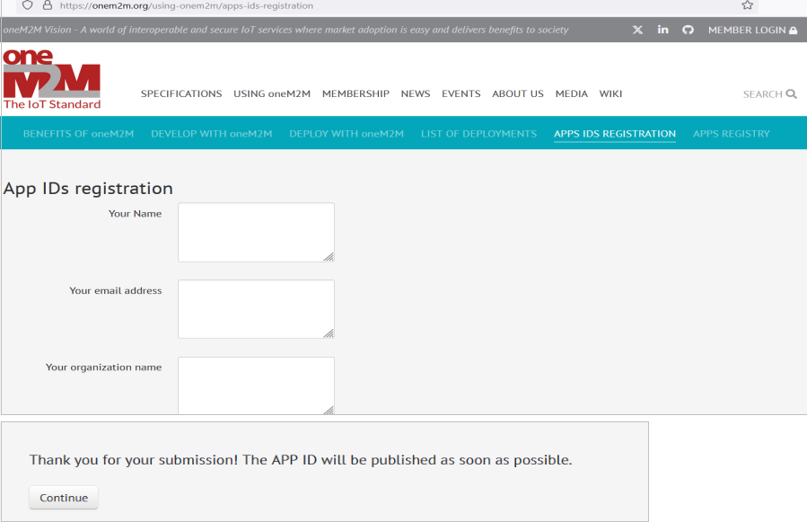

## OneM2M - App-ID Registration

The vendor will register the App-ID in the OneM2M App-ID Registry as `Ra1.<vendor_domain>.irn`. For more details, visit the <a href="https://www.onem2m.org/using-onem2m/apps-ids-registration" target="_blank">OneM2M App-ID Registry</a>.

### Apps IDs Registration(onem2m.org)

It may take 2 business days for the registration of App-Id in oneM2M, kindly note the App-Id can be mailed as per the clause 18.2 of the <a href="https://drive.google.com/file/d/1AlJyqVTAuHws3nKtmze3yb9llTVZrAXd/view?pli=1" target="_blank">Communication Message Format (as per oneM2M standard) Document</a>
